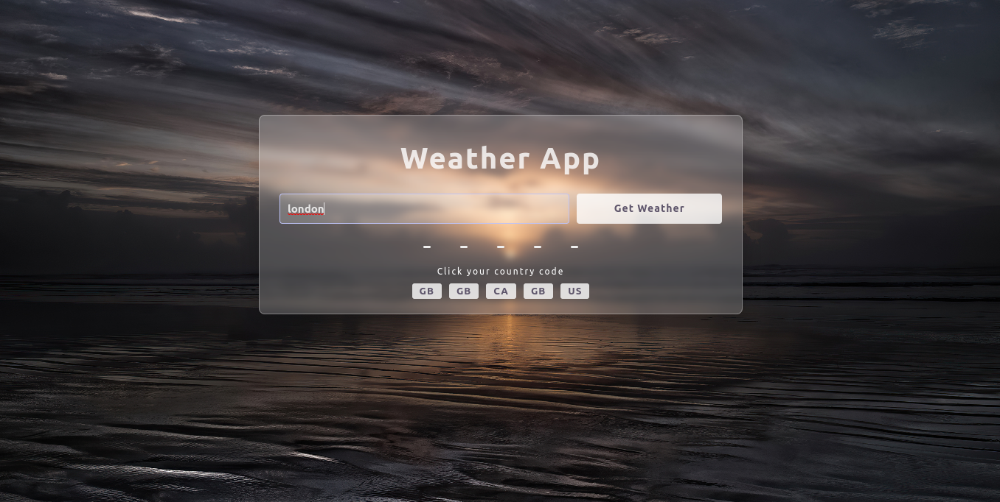
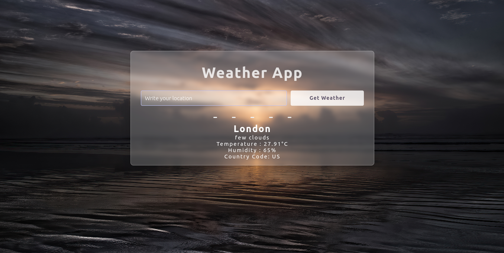
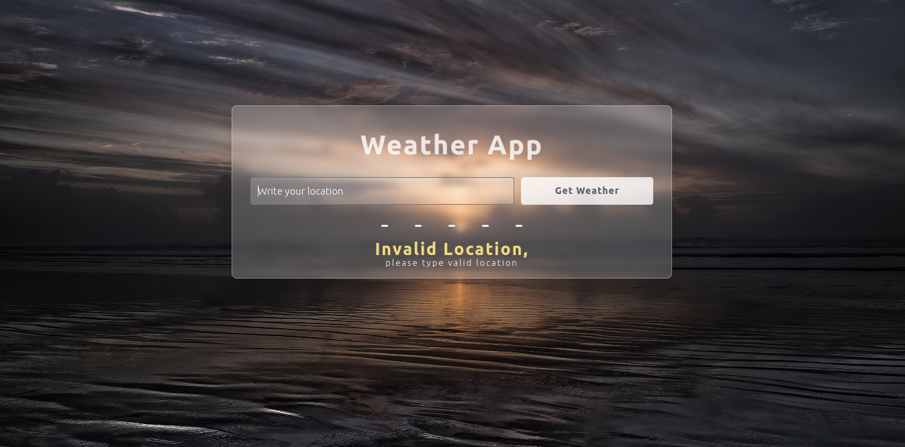

# Weather App

A simple and responsive weather application built with HTML, CSS, and JavaScript.  
Fetches real-time weather data from OpenWeatherMap API based on user input.

---

## Features
- Search for any location worldwide
- Handles multiple location results with country code selection
- Displays current weather, temperature, humidity, and location info
- User-friendly interface with loading and error messages

---

## Demo Screenshots

### Multiple Selection of Locations


### Weather Data Display


### Error UI


---

## How to Use
1. Open the `index.html` file in your browser.
2. Enter a location name in the search bar.
3. View the weather details or handle errors if location is invalid.

---

## Setup Instructions

- You need to obtain an API key from [OpenWeatherMap](https://openweathermap.org/api).
- Replace the placeholder API key in the JavaScript code:
  
  ```js
  const apiKey = "YOUR_API_KEY"; // Insert your API key here
